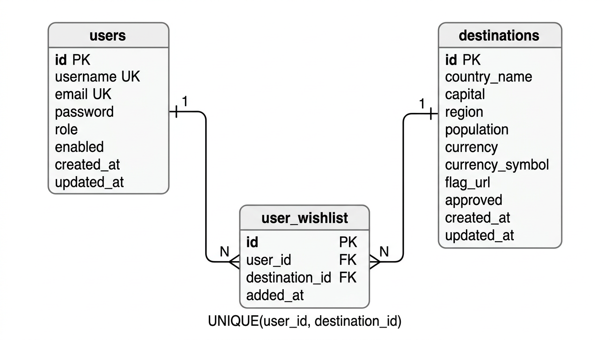

# Travel Destination Planner - Setup Guide

## Clone the Project

```bash
git clone https://github.com/Mohamedgamaal16/travelDestinationPlanner.git
cd travelDestinationPlanner
```

## Run the Application with Docker

1. Open **Docker Desktop** on your PC.
2. Run the following command:

```bash
docker-compose up -d
```

3. Wait a few minutes for all required containers to download and start.

## Access the Application

After the containers are running, you can access the services using the following URLs:

* Swagger UI:
  http://localhost:5050/swagger-ui/index.html

* Frontend Application:
  http://localhost:4200/

* Monitoring Dashboard (Grafana):
  http://localhost:3000/?orgId=1&from=now-6h&to=now&timezone=browser

* postman collection:
  https://www.postman.com/mohamed-sayed-efacc815-7247147/workspace/fawry/collection/49578324-ad528c14-bdde-45f3-a339-cca9292b8a33?action=share&source=copy-link&creator=49578324
  
## Login Credentials

### Admin Login

```json
{
  "email": "admin@traveldestinationplanner.local",
  "password": "Admin@123456"
}
```

### User Login

```json
{
  "email": "user@traveldestinationplanner.local",
  "password": "Admin@123456"
}
```

---

Make sure Docker is running properly before executing the command.


---

## 📊 1) Entity Relationship Diagram (ERD)




---

## 🔄 2) System Flow


---

## 🔐 3) Authentication Flow


